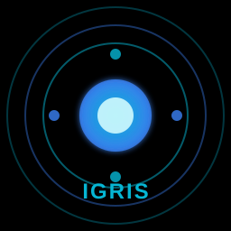

# IGRIS v3 - Advanced Offline AI Voice Assistant

A powerful, fully offline voice-activated AI assistant built with Rust and Dioxus 0.7. IGRIS provides hands-free control over your desktop with natural language understanding, camera control, and an extensible plugin system.



## 🎯 Key Features

### 🎤 Voice Processing Pipeline
- **Wake Word Detection** - Say "Arise" to activate IGRIS
- **Speech Recognition** - Offline STT using Whisper (base-q8_0 quantized model)
- **Natural Language Understanding** - SBERT-powered semantic intent recognition
- **Text-to-Speech** - Piper TTS with LibriTTS voice model
- **Voice Activity Detection** - Real-time speech boundary detection

### 🖥️ System Control
- **Application Launcher** - Open/close apps by voice
- **System Commands** - Volume, brightness, WiFi, Bluetooth, sleep, shutdown (all plugin-based)
- **File Operations** - Create, delete, search files with multi-threaded search
- **Camera Control** - FFmpeg-based photos & video recording with preview UI
- **Web Search** - Search and read results aloud
- **Alarms & Reminders** - Set time-based notifications with background scheduler

### 🎬 Self-Presentation Mode
- **Animated Slides** - Full-screen presentation UI
- **TTS Narration** - IGRIS explains its own architecture
- **Interactive Diagrams** - Visual flowcharts for Voice and NLU systems
- **Voice Command** - Say "Tell me about yourself" to start

### ⚡ FastSwap File Transfer
- **Cross-Platform Sharing** - Compatible with LocalSend v2.0 protocol
- **Network Discovery** - Automatic device scanning on local network
- **Real-Time Progress** - Live transfer progress with speed and ETA
- **Multi-File Support** - Send multiple files with per-file progress tracking
- **Modern UI** - Dark gradient interface with animated progress bars

### 🔌 Plugin System
- **Built-in Plugins** - Browsers, utilities, media, office, gaming, creative apps, system control, reminders
- **App Aliases** - Smart recognition (e.g., "Chrome" → "google chrome")
- **Fully Plugin-Based** - All commands routed through unified plugin system

## 🎨 UI Design

- **Dark Theme** - Gradient background (#0a0a0a → #1a1a2e)
- **Purple Accent** - IGRIS awake mode (#a855f7, #7c3aed)
- **Cyan Accent** - Standby mode (#06b6d4, #3b82f6)
- **Glow Effects** - Animated orb with personality-based colors
- **Responsive** - Scales smoothly with window size

## 🚀 Quick Start

### Prerequisites
- Rust 1.70+ 
- Windows 10+, macOS 10.13+, or Linux
- 4GB RAM (8GB recommended)
- 500MB disk space for models
- Network access for FastSwap file transfers (port 53317)

### Installation

```bash
# Clone
git clone https://github.com/yourusername/igrisv3.git
cd igrisv3

# Build & Run
cargo run --release
```

First launch automatically downloads:
- Whisper STT model (~81MB)
- Piper TTS + voice model (~50MB)
- SBERT NLU model (~80MB)
- FFmpeg (Windows only, ~100MB)

### First Use

1. Wait for setup to complete
2. Say **"Arise"** to wake IGRIS
3. Give a command: "Open Chrome", "What time is it", "Tell me about yourself"

## 📖 Voice Commands

### Applications
```
"Open Chrome"
"Close Firefox"  
"Close all applications"
```

### System
```
"Increase volume by 50"
"Set brightness to 80"
"Decrease volume by 20"
"Lock screen"
"Shutdown"
"Enable WiFi"
"Disable Bluetooth"
```

### Alarms & Reminders
```
"Set alarm for 7 am"
"Wake me up at 6:30 pm"
"Remind me in 30 minutes"
"Remind me to call mom in 2 hours"
"Show alarms"
"Cancel all reminders"
```

### Files
```
"Search for *.pdf files"
"Create file notes.txt"
"Open downloads folder"
```

### Camera
```
"Take a photo"
"Start recording"
"Stop recording"
"Open camera"
"Close camera"
```
*Photos/videos saved to Pictures/Videos folder with preview UI*

### FastSwap
```
"Open FastSwap"
"Fast swap"
"Share files"
```
*Click menu button to access file sharing panel*
- Scan for nearby devices on local network
- Select files to send with visual file picker
- Monitor transfer progress with real-time updates
- Cancel transfers in progress
- Compatible with LocalSend apps on mobile/desktop

### Assistant
```
"Tell me about yourself"  → Starts presentation
"Sleep"                   → Return to wake word mode
"Exit"                    → Shutdown assistant
```

## 🏗️ Architecture

```
src/
├── main.rs              # Dioxus UI + voice loop
├── config.rs            # JSON configuration
├── core/                # Voice pipeline
│   ├── stt.rs           # Whisper integration
│   ├── tts.rs           # Piper TTS
│   ├── vad.rs           # Voice activity detection
│   └── wake_word.rs     # Wake word detection
├── nlu/                 # Natural Language Understanding
│   ├── engine.rs        # Intent matching
│   ├── sbert.rs         # Semantic embeddings
│   ├── ner.rs           # Entity extraction
│   └── context.rs       # Conversation memory
├── commands/            # Command handlers
│   ├── system.rs        # System control
│   ├── files.rs         # File operations
│   ├── ffmpeg_camera.rs # FFmpeg camera control
│   ├── reminders.rs     # Alarms & reminders
│   └── about.rs         # Self-introduction
├── plugins/             # Plugin system
│   ├── system.rs        # Plugin manager
│   └── builtin/         # Built-in plugins
│       ├── browsers.rs      # Chrome, Firefox, Edge
│       ├── utilities.rs     # Calculator, Notepad
│       ├── camera.rs        # Camera control
│       ├── files.rs         # File operations
│       ├── reminders.rs     # Alarms & reminders
│       └── system_control.rs # Volume, brightness, power
├── ui/                  # Dioxus components
│   ├── settings.rs      # Settings panel
│   ├── camera_panel.rs  # Camera UI
│   ├── fastswap_panel.rs # File sharing UI
│   └── presentation/    # Self-presentation UI
├── fastswap/          # File transfer module
│   ├── models/          # Device, transfer, progress models
│   └── network/         # Discovery, server, client
└── setup_manager/       # First-run setup
    ├── downloader.rs    # Model downloads
    ├── permissions.rs   # Module permissions
    └── platforms/       # Platform-specific setup
```

### Data Flow

```
Audio → VAD → Whisper STT → NLU (SBERT) → NER → Command Handler → TTS → Audio
```

## ⚙️ Configuration

Settings saved to `pkg/config.json`:

```json
{
  "personality": "Igris",
  "recognition": {
    "sensitivity": 0.45,
    "max_listen_sec": 15
  },
  "tts": {
    "speed": 1.0,
    "volume": 0.8
  },
  "hotkey": {
    "modifier": "Ctrl+Shift",
    "key": "Space"
  }
}
```

## 📦 Models Used

| Model | Size | Purpose |
|-------|------|---------|
| ggml-base-q8_0.bin | 81MB | Whisper STT (quantized) |
| en_US-libritts_r-medium.onnx | 50MB | Piper TTS voice |
| all-MiniLM-L6-v2 | 80MB | SBERT embeddings |

## 🛠️ Development

```bash
# Debug build
cargo build

# Release build
cargo build --release

# Run tests
cargo test
```

## 🐛 Troubleshooting

| Issue | Solution |
|-------|----------|
| Mic not working | Check permissions, try different device |
| STT slow | Use release build (`cargo run --release`), check CPU usage |
| Models missing | Delete pkg/ folder, restart for fresh download |
| Camera error | Ensure no other app using camera, FFmpeg will auto-detect devices |
| Volume/Brightness not working | Windows: May need nircmd.exe in PATH or admin privileges |
| Alarm not triggering | Check system time, background thread runs every 10 seconds |
| FastSwap not finding devices | Ensure devices on same network, check firewall allows port 53317 |
| File transfer fails | Check network stability, recipient may have rejected transfer |

## 📝 License

MIT License - see LICENSE file.

## 🤝 Contributing

1. Fork the repo
2. Create feature branch
3. Commit changes
4. Open Pull Request

## 🔮 Roadmap

- [x] SBERT semantic NLU
- [x] Self-presentation mode
- [x] FFmpeg-based camera (removed nokhwa dependency)
- [x] Multi-threaded file search
- [x] Alarms & Reminders with background scheduler
- [x] Fully plugin-based architecture
- [x] Dynamic camera/mic detection
- [x] Smart command validation & fallback
- [x] FastSwap file transfer with real-time progress
- [ ] Voice-activated file sharing
- [ ] File receive notifications
- [ ] Transfer history persistence
- [ ] Multi-language support
- [ ] Custom wake word training
- [ ] Voice command history & analytics
- [ ] Enhanced camera features with filters

---

**IGRIS v3** - Your intelligent offline voice assistant.

*Say "Arise" to begin.*
